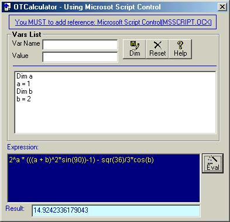



## OTcalculator

### Description

OTcalculator usign Microsoft Script Control.

----

Microsoft Script Control is an OCX control of Microsoft and you can include in you VB programs for manage code at execution time, you can add code and vars with Addcode Method, you can evaluate expressions with eval() function easily.

It's too easy add code, modules, procedures, functions dynamically.

(You can to combine with callbyname function for make dynamic programs

and you can save code sections, functions in tables and load them in your programs)

olto22@hotmail.com
 
### More Info
 
Expression as string

Expression Evaluated

             |
---                |---
**Submitted On**   |2002-03-07 17:01:30
**By**             |[Oliver Toro](https://github.com/Planet-Source-Code/PSCIndex/blob/master/ByAuthor/oliver-toro.md)
**Level**          |Advanced
**User Rating**    |4.7 (14 globes from 3 users)
**Compatibility**  |VB 5\.0, VB 6\.0, VB Script
**Category**       |[Complete Applications](https://github.com/Planet-Source-Code/PSCIndex/blob/master/ByCategory/complete-applications__1-27.md)
**World**          |[Visual Basic](https://github.com/Planet-Source-Code/PSCIndex/blob/master/ByWorld/visual-basic.md)
**Archive File**   |[OTcalculat60263372002\.zip](https://github.com/Planet-Source-Code/oliver-toro-otcalculator__1-32440/archive/master.zip)

